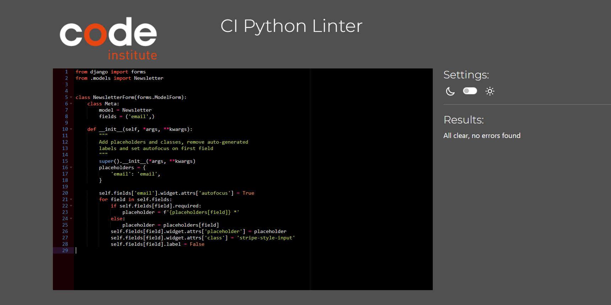

Portfolio Project 5 -  Fitness Palace

The deployed [Fitness Palace]() app.

The [GitHub repository](https://github.com/osaroo3/fitness-palace-ci-project5) 

## Project goals

The goal of this project is to build a fitness subscription application with features such as user's ability to join a fitness community and purchase exercise plans and merchandise. Also, for site owner to be able to build an active community around the product based on subscription and individual payments model, sell exercise and nutrition plans, nutrition and exercise products.

<!-- ## Marketing strategy -->

# Table of content

- [**UX (User Experience)**](#ux-user-experience)
  - [**User Stories**](#user-stories)
- [**Design and Site Structure**](#design-structure)
  - [**Functional Structure**](#functional-structure)
  - [**Wireframes**](#wireframes)
- [**Features**](#features)
  - [**Responsive Design**](#responsive-design)
- [**Technologies**](#technologies)
  - [**Languages**](#languages)
  - [**Frameworks and Libraries**](#frameworks)
  - [**Tools**](#tools)
- [**Testing**](#testing)
- [**Deployment**](#deployment)
- [**Credits**](#credits)
  - [**Code**](#code)
  - [**Content and media**](#content)
  - [**Acknowledgments**](#acknowledgments)

## UX (User Experience)

### User stories

#### First time visitor goals

As a first time visitor, I want:
* to know the purpose of the site at first glance.
* to navigate the site intuitively.
* to have access to all features of the site after registering an account.
* to be able to make subscription to available plans.
* to be able to make purchases of products.
* to contact the facility managers
       
        
#### Returning and frequent user goals

As a returning user, I want:
* to access my user account by signing in.
* to make and view my subscriptions. 
* to be able to sign out of my account as a safety measure.
* view my profile and orders

#### Site Administrator/ Facility management goals

* Sell execise and nutritional plans
* Sell exercise and nutritional products
* Build an active community based on subscription
* As a site administrator, I want to create, read, update and delete products. 
* Receive messages from our site users via contact us page.   

### Agile tools

GitHub Projects feature was used as a [Kanban board]() for the development of this project, which made is easy to track the progress made and goals attained.
[User stories]() was used to structure the project into sections of tasks to be achieved, with the kenban board providing the platform. 

## Design and Site structure

The design and structure of the projects is a modification of the code Institutes Boutique Ado project to meet the required features of Fitness Subscription Application project. The fonts, text, color et. al. have been chosen for simplicity and effectiveness in gaining site visitor attention.

Fitness Palace look at first glance

 

### Functional Structure

**Home page:** The home page has navigation bar features, images, features that link to other areas of this site, to enable users get a good grasp of what this site is about.

**All products:** The all products has a drop down functionality that enables users to access products more effectively utilising the filter functionality enbedded in the dropdown list options. 

**Clothing:** This has a filter capabilities to render only clothing products.

**Nutrition:** This maps to a dropdown link with filter feature to nutrition products.

**Plans :** The maps to two dropdown links to either take the user to all plans available or plans the user subscribed to.

**login page:** The feature is only available to registered users to enable them have full user access.

**Logout page:** Only registered users have the ability to logout..

<!-- 
### Wireframes

The wireframes used are shown below although modified in the project work:

**Models**

Menu model

Booking model

 

**For Mobile view and small screens**

Book now page

Home page

Menu page

My bookings page

 

**For Desktop view**

Home page

Menu page

My bookings page

Book now page

  -->

## Features

### Navbar

Because the base is being extended, the navigation bar is present on all pages of the site. The navbar also collapses into a burger icon for smaller screen sizes.

### Home page

On the Home page, unauthorised users cannot access the dropdown features of 'My account' except the register and login features. 

### Sign up page

This page allows unauthorised users to create an account by following the instructions.

### Login page

This page allows user's with account to login by providing their credentials.

### All products page

The all products has a dropdown feature to links such as by price, by rating, by categories and all products. These features has filter capabilities to enable users access their needs as quickly as possible. The all link to the products page with their distinct filter applied.

### Fitness product

To access on fitness products, click 'clothing' on the to header. This feature enables the user to access the products page, However, only fitness products are displayed.

### Nutrition product

To access on Nutrition products, click 'nutrition' on the to header. This feature enables the user to access the products page, However, only nutrition products are displayed.

### Plans

This dropdown feature enables users to access the 'All Plans' page and 'My Plans' page. The all plans page displays all plans users can subscribe to while, the my plans page shows plans users have subscribed to.

If the user has no plan subscription, the image below shows.

### Profile page

A logged in user can view and update their profile while also viewing and product purchase made. However, during checkout, if 'save this delivery information to my profile' checkbox is checked, the user profile is updated with that information.

### Members page

A logged in user can access the members page. They can view all members of Fitness Palace, see members updates about their successess, and also update members too.

### Contact Us page

Site users can via the contact us page, contact Fitness Palace to make enquiries or complaints.

### Subscribe to Newsletter page

logged in users can subscribe to Fitness Palace newsletters to get up-to-date information about neal deals, plans, products e.t.c

### Logout page

A logged in user can log out by clicking the logout button on the 'my accounts' dropdown link. This action takes the user to the sign out page to get confirmation before the user is logged out.

### Add products

This feature is only available to facility/admin managers. They can add new products to the site.

### Edit products

This feature is only available to facility/admin managers. They can edit products on the site.

### Delete products

This feature is only available to facility/admin managers. They can delete products on the site.

### Product details page

Once a product is clicked, it shows the product detail page for that individual product. The user can add that product to bag. Also, the user can scroll down this page and leave a review for that product if they desire. However, this review is subject to approval. They can update it and also delete it.

### Reviews page

The reviews page showing all reviews about a product from users can be access in the product details page. Once, clicked users can see all reviews about that particular product.

### Responsive design

The site was designed to be responsive for both desktop and mobile use and has been tested using the Google Chrome Developer multi-device emulator with different screen sizes.

## Future features

- 

## Technologies Used

### Languages

  - HTML5
  - CSS3
  - JavaScript
  - Python
 

### Frameworks, Libraries, Programs

  - [Django](https://www.djangoproject.com/): python framework was used to create the backend 

### Database:
  - [PostgreSQL](https://www.postgresql.org/): the database was used to store all the data.

### Media: 
  - [AWS](https://aws.amazon.com/): Was use to store all media files

### Programs & Tools

- [Google Fonts](https://fonts.google.com/): Was used for the font styling.  
- [Font Awesome](https://fontawesome.com/): was used to generate the icons on the website.
- [Bootstrap](https://getbootstrap.com/): Was used to create the front-end design.
- [Gitpod](https://Gitpod.io/): was used as IDE to commit and push the project to GitHub.
- [GitHub](https://github.com/): Was used as the version control system to manage the code
- [Canva:](https://www.canva.com/) Was used to create wireframes
- [Am I Responsive](http://ami.responsivedesign.is/): was used to generate an image showing the website's responsiveness on different screen sizes 
- [Pip3](https://pypi.org/project/pip/): is the package manager to install Python modules and libraries.
- [Gunicorn](https://docs.djangoproject.com/en/4.1/howto/deployment/wsgi/gunicorn/): "Green Unicorn" is a Python Web Server Gateway to translate HTTP Requests for Python to understand.
- [Psycopg2](https://pypi.org/project/psycopg2/): PostgreSQL database adapter to manage the Database in Python. 
- [Heroku](https://dashboard.heroku.com/): the hosting service used to host my website.
- [Chrome Developer Tools](https://developer.chrome.com/docs/devtools/open/): was used to debug the website.
- [W3C Validator](https://validator.w3.org/): was used to validate HTML5 codes for this website.
- [W3C CSS validator](https://jigsaw.w3.org/css-validator/): was used to validate CSS codes for this website.
- [Github Projects and Kanban board](https://github.com/users/LarisaLG/projects/17/views/1): was used to track the progress of the project.
- [CI python linter](https://pep8ci.herokuapp.com/): was used to validate python codes.
- [JS Hint](https://jshint.com/): was used to validate JavaScript codes.
- [AWS](https://aws.amazon.com/): was used to store media files.

## Testing

### Bugs

#### Fixed Bugs

#### Unresolved Bugs

<!--
### Manual Testing

#### Device Testing

This Project was tested via a multi-device emulator with different display sizes in the Google Chrome Developer Dashboard.
The devices tested are below:

- Galaxy fold (Mobile)
- Samsung Glaxy s8 (Mobile)
- Nest HubMax (Desktop)
- Nest Hub (Desktop)
- iPad Air (Tablet)
- iPad Mini (Tablet)
- iPhone 12 pro (Mobile)
- iPhone 14 pro max (Mobile)

#### Browsers Tested

The browsers used for testing were as follows: 
  - Google Chrome
  - Firefox
  - Microsoft Edge

Site testing was done on the Gitpod environment and Heroku.
The available functionality and user experience is reflected in the table below.

| Goals/actions  | As a guest | As a logged user  | Result | Comment |
|--|:--:|:--:|:--:|--|
| I can see the home page | &check; | &check; | Pass | Unauthorised users can't see My bookings page and Book now page |
| I can see the Login page  | &check; |&check;  |  Pass| |
| I can see the Register page | &check; |&check;  |  Pass| |
| I can see the Logout page  | &cross; |&check;  |  Pass| Available only to an authorized users |
| I can see the Menu page | &check; |&check;  |  Pass| |
| I can click on My bookings and make bookings as a logged in user | &cross; | &check; | Pass | Available only to an authorized users|
| I can modify bookings | &cross; |&check;  |  Pass| Available only to an authorized users | Available only to authorized users
| I can delete bookings | &cross; |&check;  |  Pass| Available only to an authorized users | Available only to authorized users
| I can click the Book now nav link and see the Book now page | &cross; |&check;  |  Pass| Available only to authorized users
| I can fill fields in the Book now form | &cross; | &check;  | Pass |Available only to authorized users |
| I can see the MY bookings page   | &cross; | &check;  | Pass | Available only to authorized users|

 
-->

## Validation

### HTML Validation:

The [W3C Markup Validation Service](https://validator.w3.org/) was used to validate the HTML of the website. 
Errors was noticed when carrying out HTML validation for the sign up page. Since it's a generated form from CI codestar blog project, there is no access to the form to do the neccessary modification of the code.

Home page

Menu page

Sign up page

Login page

My bookings page

Book Now page

Modify booking page

Delete booking page

Logout page

---
### CSS Validation:

The website CSS styling was validated using [W3C Jigsaw CSS Validation Service](https://jigsaw.w3.org/css-validator/). 

---
### JavaScript Validation:

The website JavaScript code was validated using [JSHint Validation](https://jshint.com/). 

---
 

### Python Validation (PEP8)

All Python code was checked manually with the aid of  [CI Python Linter](https://pep8ci.herokuapp.com/). Errors observed have all been fixed. 

- urls.py

bag urls.py

checkout urls.py

contact us urls.py

fitness palace urls.py

home urls.py

members urls.py

newsletter urls.py

products urls.py

profiles urls.py

subcheckout urls.py

subscribe urls.py

 

- views.py

bag views.py

checkout views.py

contact us views.py

fitness palace views.py

home views.py

members views.py

newsletter views.py

products views.py

profiles views.py

subcheckout views.py

subscribe views.py

 

- forms.py

checkout forms.py

contact us forms.py

members forms.py

newsletter forms.py

products forms.py

profiles forms.py

subcheckout forms.py

 

- apps.py

bag apps.py

checkout apps.py

 

- contexts.py

bag contexts.py

 

- signals.py

checkout signals.py

 

- webhook_handler.py

 checkout webhook_handler.py

 subcheckout webhook_handler.py

 

- webhook.py

 checkout webhook.py

 subcheckout webhook.py

 

- admin.py

checkout admin.py

contact us admin.py

members admin.py

newsletter admin.py

subcheckout admin.py

 

- models.py

checkout models.py

contact us models.py

members models.py

newsletter models.py

products models.py

profiles models.py

subcheckout models.py

subscribe models.py

---
<!--

##  Deployment

The development of this project was done with Gitpod, stored on GitHub and deployed using Heroku.
1. Visit [Heroku](https://heroku.com/)
2. Log in or create an account if applicable.
3. On the Heroku dashboard click on the 'new' button.
4. From the drop-down menu select 'Create new app'.
5. Choose your preferred app name.
6. Select the applicable region and click 'Create App'.
7. Navigate to 'Settings' and scroll down to the 'Config Vars' section. Click on 'Reveal Config Vars' and enter 'PORT' for the key and '8000' for the value and then click 'Add'. Repeat the key and value entry for your DATABASE_URL(the database you are using) and SECRET_KEY(you generated during production).
8. Click on the 'Deploy' tab. Select GitHub and the connect to the relevant repository. Click 'Deply branch'. You can also select 'Automatic Deploys' so that the site updates when updates are pushed to GitHub, however, you must set 'DEBUG = False' in your settings.py to avoid security concerns for your site.
9. After your deployment is successful click 'Open app' to view thelive app.

### Forking the GitHub Repository

To use this code and make changes without affecting the original code, it is possible to 'fork' the code on the GitHub repository through the following steps:

1. Create  or log into your GitHub account.
2. Go to the GitHub [repository](https://github.com/osaroo3/django_restaurant_ci_project4).
3. Click the 'Fork' button in the upper right-hand corner of the page.
A copy of the repository will be available in your own repository.

### Making a Local Clone
1. Log in to GitHub and locate the GitHub Repository
2. Under the repository name choose button "Code",  click "Clone or download".
3. To clone the repository using HTTPS, under "Clone with HTTPS", copy the link.
4. Open your development editor of choice and open a terminal window in a directory of your choice
5. Type *git clone*, and then paste the URL you copied in Step 3.

``> git clone https://github.com/YOUR-USERNAME/YOUR-REPOSITORY``

Press Enter. 

Your local clone will be created.

For more information follow this [link](https://docs.github.com/en/repositories/creating-and-managing-repositories/cloning-a-repository#cloning-a-repository-to-github-desktop).

[Back to the top](#table-of-contents)

## Credits

### Code

The idea for structure and the code of this project was from Code Institute's Codestar blog walkthrough project and LarisLG [Barbershop](https://github.com/LarisaLG/barbershop) project:
  * The base.html code and styling is a modification of that of the codestar blog project.
  * Credit to LarisaLG for the idea of the menu, my bookings and book now html page with styling.
  * Credit to LarisaLG for Date picker field and minimum date validator.
  * The javaScript code for deleting a booking was from codestar blog project.
  * The idea for my models.py was from Codestar blog and barbarshop by LarisaLG.
  * Credit to [W3schools](https://www.w3schools.com/django/django_404.php) for the idea to handle double booking server error.
  * Credit to [Django documentation](https://docs.djangoproject.com/en/5.0/) for "Everything you need to know about Django".

### Content and Media

  * credit to LarisaLG for the readme structure.
  * Credit to LarisaLG on how to fork a GitHub repository or make a local clone.

Credit to the following for the images of my homepage:
1. [Abacha](https://apocomkitchen.co.uk/assets/front/img/product/sliders/615b138763c10.jpg)
2. [Nkwobi](https://worldlytreat.com/wp-content/uploads/2023/03/Nkwobi-spicy-cow-leg-7.jpg)
3. [Jollof](https://www.tastingtable.com/1000081/jollof-wars-the-dispute-surrounding-this-west-african-rice-dish/)
4. [Fried rice](https://www.sweetnspicee.com/wp-content/uploads/2020/11/LEY_1301-scaled.jpg)
5. [Yam porridge](https://guardian.ng/wp-content/uploads/2020/05/Vegetable-Yam-Porridge.-Photo-My-diaspora-kitchen.jpeg)
6. [Egusi soup](https://www.forksandfingers.co.uk/wp-content/uploads/2019/06/Pounded-Yam.jpg.pagespeed.ce.GB0JCqfsKY.jpg)
7. [Afang Soup](https://guardian.ng/wp-content/uploads/2018/09/Afang-soup-recipe-579x598.png)
8. [Oha soup](https://www.vemscrunch.co.uk/wp-content/uploads/2022/08/Oha-Soup.jpg)
9. [Banga soup](https://i.pinimg.com/736x/f3/d8/03/f3d803ce13eec61ea8a1a6bbd7d1fff3.jpg)

Note: The use of these images were strictly for educational purposes only

### Acknowledgments

I wish to acknowledge my mentor Martina Terlevic , Code Institute's 'Tutor me' and the CI slack community for all the support thus far. -->
