# Portfolio Project 5 -  Fitness Palace


The deployed [Fitness Palace](https://fitness-palace-ci-project5-2dde85b1703c.herokuapp.com/) app.

The [GitHub repository](https://github.com/osaroo3/fitness-palace-ci-project5) 

## Project goals

The goal of this project is to build a fitness subscription application with features such as user's ability to join a fitness community and purchase exercise plans and merchandise. Also, for site owner to be able to build an active community around the product, based on subscription and individual payments model. Sell exercise and nutrition plans, nutrition and exercise products.

## Marketing strategy

The marketing startegy employed here are, SEO, social media marketing and email marketing.

- Search engine optimization (SEO):

How best to get our search engine rank high was the aim. Here, meta tag description and keywords where used as part of the optimisation goal, also sitemaps.xml and robots.txt files where used for the optimization process.

- Social media marketing:

Facebook business page was created as a cost effective way of gaining more reach using the power of social media to draw attention to our website and what we offer.

- Email marketing:

Email marketing was another way of reaching out to our subscribers in order to keep them with us and continually get their loyalty and patronage.

# Table of content

- [**UX (User Experience)**](#ux-user-experience)
  - [**User Stories**](#user-stories)
- [**Design and Site Structure**](#design-structure)
  - [**Functional Structure**](#functional-structure)
  - [**Wireframes**](#wireframes)
- [**Features**](#features)
  - [**Responsive Design**](#responsive-design)
- [**Technologies**](#technologies)
  - [**Languages**](#languages)
  - [**Frameworks and Libraries**](#frameworks)
  - [**Tools**](#tools)
- [**Testing**](#testing)
- [**Deployment**](#deployment)
- [**Credits**](#credits)
  - [**Code**](#code)
  - [**Content and media**](#content)
  - [**Acknowledgments**](#acknowledgments)


## UX (User Experience)

### User stories

#### First time visitor goals

As a first time visitor, I want:
* to know the purpose of the site at first glance.
* to navigate the site intuitively.
* to have access to all features of the site after registering an account.
* to be able to make subscription to available plans.
* to be able to make purchases of products.
* to contact the facility managers
       
        
#### Returning and frequent user goals

As a returning user, I want:
* to access my user account by signing in.
* to make and view my subscriptions. 
* to be able to sign out of my account as a safety measure.
* view my profile and orders.
* to view a list of products and make purchases.


#### Site Administrator/ Facility management goals

* Sell execise and nutritional plans
* Sell exercise and nutritional products
* Build an active community based on subscription
* As a site administrator, I want to create, read, update and delete products. 
* Receive messages from our site users via contact us page.   


### Agile tools

GitHub Projects feature was used as a [Kanban board](https://github.com/users/osaroo3/projects/3/views/1) for the development of this project, which made is easy to track the progress made and goals attained.
[User stories](https://github.com/osaroo3/fitness-palace-ci-project5/issues?q=is%3Aissue+is%3Aclosed) was used to structure the project into sections of tasks to be achieved, with the kenban board providing the platform. 


## Design and Site structure

The design and structure of the projects is a modification of the code Institutes Boutique Ado project to meet the required features of Fitness Subscription Application project. The fonts, text, color et. al. have been chosen for simplicity and effectiveness in gaining site users attention.

<details>
<summary>Fitness Palace look at first glance</summary>


</details>


### Functional Structure

**Home page:** The home page has navigation bar features, images, features that link to other areas of this site, to enable users get a good grasp of what this site is about.

**All products:** The all products has a drop down functionality that enables users to access products more effectively utilising the filter functionality enbedded in the dropdown list options. 

**Fitness:** This maps to a dropdown link with filter feature to fitness products.

**Nutrition:** This maps to a dropdown link with filter feature to nutrition products.

**Plans :** The maps to two dropdown links to either take the user to all plans available or plans the user subscribed to.

**login page:** The feature is only available to registered users to enable them have full user access.

**Logout page:** Only registered users have the ability to logout..

 
### Wireframes

The wireframes used are shown below:

**Models**

<details>
<summary>Review model</summary>


</details>

<details>
<summary>Contact model</summary>


</details>

<details>
<summary>Membership model</summary>


</details>

<details>
<summary>Newsletter model</summary>


</details>

<details>
<summary>Order model</summary>


</details>

<details>
<summary>Plan model</summary>

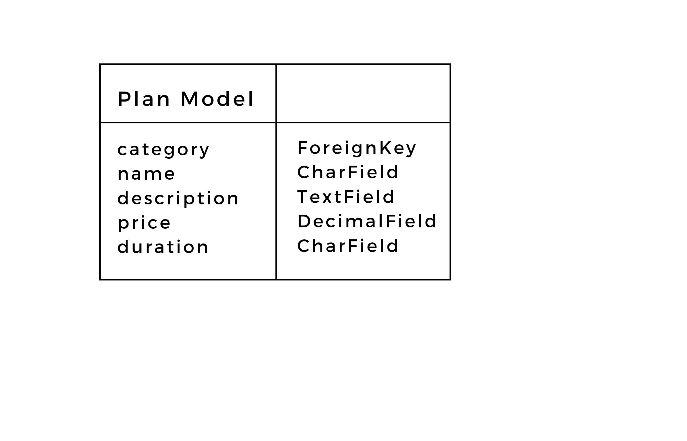

</details>

<details>
<summary>Userprofile model</summary>


</details>

<details>
<summary>Product model</summary>


</details>

<details>
<summary>Checkout model</summary>


</details>

<details>
<summary>Category model</summary>


</details>

<details>
<summary>OrderLineItem model</summary>


</details>
</br>

**For Mobile view and small screens**

<details>
<summary>Home page</summary>


</details>

<details>
<summary>All products page</summary>


</details>

<details>
<summary>All plans page</summary>


</details>

<details>
<summary>My plans page</summary>


</details>

<details>
<summary>My profile page</summary>


</details>

<details>
<summary>Members page</summary>


</details>

<details>
<summary>Contact us page</summary>


</details>

<details>
<summary>Newsletter subscription page</summary>

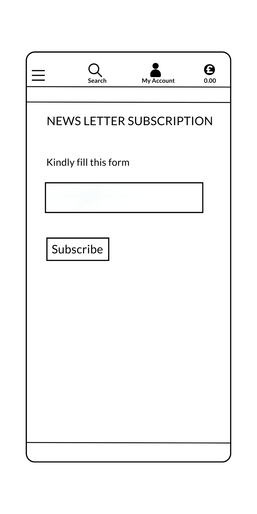

</details>

<details>
<summary>Signout page</summary>


</details>

<details>
<summary>Signup page</summary>


</details>

<details>
<summary>Sign in page</summary>


</details>


<br />

**For Desktop view**

<details>
<summary>Home page</summary>


</details>

<details>
<summary>All products page</summary>


</details>

<details>
<summary>All plans page</summary>


</details>

<details>
<summary>My plans page</summary>


</details>

<details>
<summary>My profile page</summary>


</details>

<details>
<summary>Members page</summary>


</details>

<details>
<summary>Contact us page</summary>

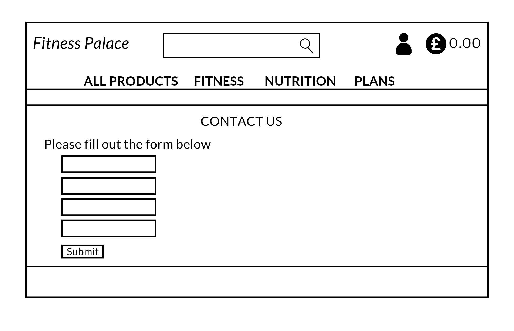

</details>

<details>
<summary>Newsletter subscription page</summary>


</details>

<details>
<summary>Signout page</summary>


</details>

<details>
<summary>Signup page</summary>


</details>

<details>
<summary>Sign in page</summary>


</details>


<br />

## Features

### Navbar

Because the base is being extended, the navigation bar is present on all pages of the site. The navbar also collapses into a burger icon for smaller screen sizes.


### Home page

On the Home page, unauthorised users cannot access the dropdown features of 'My account' except the register and login features. 


### Sign up page

This page allows unauthorised users to create an account by following the instructions.


### Login page

This page allows user's with account to login by providing their credentials.


### All products page

The all products has a dropdown feature to links such as by price, by rating, by categories and all products. These features has filter capabilities to enable users access their needs as quickly as possible. The all link to the products page with their distinct filter applied.


### Fitness product

To access on fitness products, click 'clothing' on the to header. This feature enables the user to access the products page, However, only fitness products are displayed.


### Nutrition product

To access on Nutrition products, click 'nutrition' on the to header. This feature enables the user to access the products page, However, only nutrition products are displayed.


### Plans

This dropdown feature enables users to access the 'All Plans' page and 'My Plans' page. The all plans page displays all plans users can subscribe to while, the my plans page shows plans users have subscribed to.


If the user has no plan subscription, the image below shows.


### Profile page

A logged in user can view and update their profile while also viewing and product purchase made. However, during checkout, if 'save this delivery information to my profile' checkbox is checked, the user profile is updated with that information.
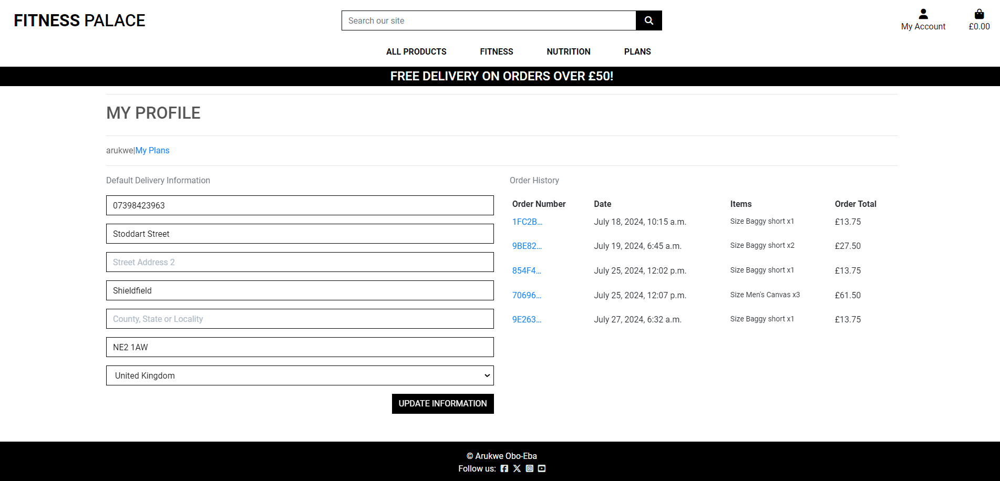

### Members page

A logged in user can access the members page. They can view all members of Fitness Palace, see members updates about their successess, and also update members too.


### Contact Us page

Site users can via the contact us page, contact Fitness Palace to make enquiries or complaints.


### Newsletter

logged in users can subscribe to Fitness Palace newsletters to get up-to-date information about new deals, plans, products e.t.c
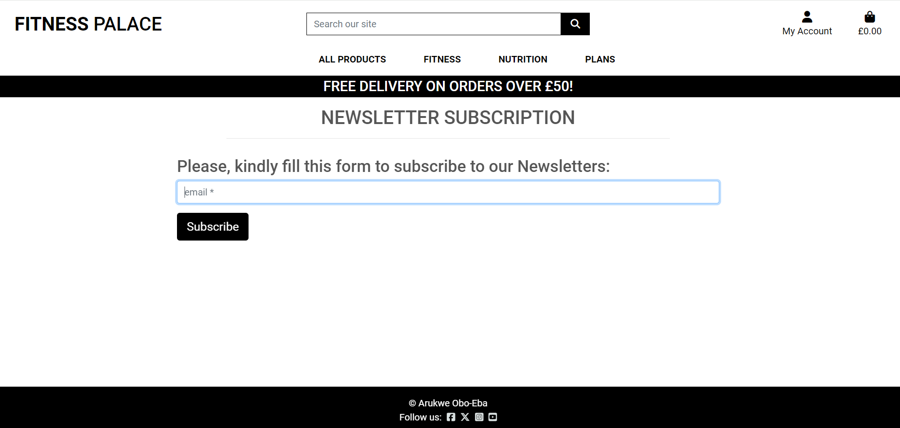

### Logout page

A logged in user can log out by clicking the logout button on the 'my accounts' dropdown link. This action takes the user to the sign out page to get confirmation before the user is logged out.


### Add products (Facilty Management)

This feature is only available to facility/admin managers. They can add new products to the site.


### Edit products (Facility Management)

This feature is only available to facility/admin managers. They can edit products on the site.


### Delete products (Facility Management)

This feature is only available to facility/admin managers. They can delete products on the site.


### Product details page

Once a product is clicked, it shows the product detail page for that individual product. The user can add that product to bag. Also, the user can scroll down this page and leave a review for that product if they desire. However, this review is subject to approval. They can update it and also delete it.

<br>

<br>


### Reviews page

The reviews page showing all reviews about a product from users can be access in the product details page. Once, clicked users can see all reviews about that particular product.


### Add to bag

Add to bag page, shows a detailed summary of product added to the bag at the top corner of the screen.

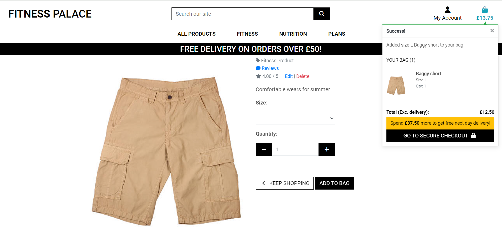

### Email verification

Email verification is sent when a user registers with fitness palace as a security/authentication measure.


### Product order success

A brief summary of the order success comes up after a successful purchase of product was completed.

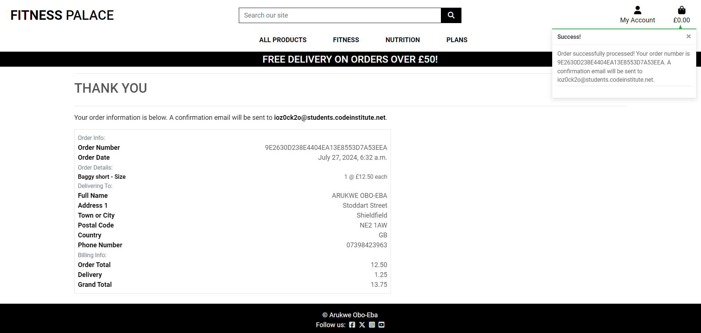

### Email confirmation of purchase/subscription

After purchase of product or subscription plan the user receives email confirmations.


### Product checkout page

This page is where certain details is required of the user to complete the purchase of products. If successful, the webhook functionality is triggered to email the user about their purchase.


<br>


### Plan checkout page

This page takes some user information to complete subscription to chosen plan. If successful, the webhook functionality is triggered to email the user about their plan subscription.


<br>


### Footer

The footer was designed to link to Fitness Palace social media account. As of now, only the facebook account exists.


### Facebook page

The facebook page is a way of drawing more attention to Fitness Palace website in order to gain new customers.

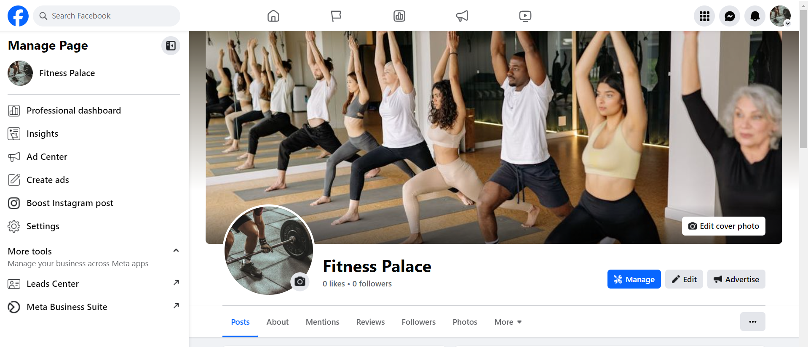
<br>

<br>


### Privacy policy


### Responsive design

The site was designed to be responsive for both desktop and mobile use and has been tested using the Google Chrome Developer multi-device emulator with different screen sizes.


## Future features

- Give admin CRUD ability to add, edit and delete plans from the front-end.
- Make the members page UI/UX more appealing.
- Add more nutritional products.
- Add more functionality to the newsletter subscription.
- Make the sites UI more captivating
- Improve the footer UI


## Technologies Used

### Languages

  - HTML5
  - CSS3
  - JavaScript
  - Python
 

### Frameworks, Libraries, Programs

  - [Django](https://www.djangoproject.com/): python framework was used to create the backend 


### Database:
  - [PostgreSQL](https://www.postgresql.org/): the database was used to store all the data.

### Media: 
  - [AWS](https://aws.amazon.com/): Was use to store all media files


### Programs & Tools

- [Google Fonts](https://fonts.google.com/): Was used for the font styling.  
- [Font Awesome](https://fontawesome.com/): was used to generate the icons on the website.
- [Bootstrap](https://getbootstrap.com/): Was used to create the front-end design.
- [Gitpod](https://Gitpod.io/): was used as IDE to commit and push the project to GitHub.
- [GitHub](https://github.com/): Was used as the version control system to manage the code
- [Canva:](https://www.canva.com/) Was used to create wireframes
- [Am I Responsive](http://ami.responsivedesign.is/): was used to generate an image showing the website's responsiveness on different screen sizes 
- [Pip3](https://pypi.org/project/pip/): is the package manager to install Python modules and libraries.
- [Gunicorn](https://docs.djangoproject.com/en/4.1/howto/deployment/wsgi/gunicorn/): "Green Unicorn" is a Python Web Server Gateway to translate HTTP Requests for Python to understand.
- [Psycopg2](https://pypi.org/project/psycopg2/): PostgreSQL database adapter to manage the Database in Python. 
- [Heroku](https://dashboard.heroku.com/): the hosting service used to host my website.
- [Chrome Developer Tools](https://developer.chrome.com/docs/devtools/open/): was used to debug the website.
- [W3C Validator](https://validator.w3.org/): was used to validate HTML5 codes for this website.
- [W3C CSS validator](https://jigsaw.w3.org/css-validator/): was used to validate CSS codes for this website.
- [Github Projects and Kanban board](https://github.com/users/LarisaLG/projects/17/views/1): was used to track the progress of the project.
- [CI python linter](https://pep8ci.herokuapp.com/): was used to validate python codes.
- [JS Hint](https://jshint.com/): was used to validate JavaScript codes.
- [AWS](https://aws.amazon.com/): was used to store media files.


## Testing

### Bugs

#### Fixed Bugs

- Some forms where not rendering. This was caused by spelling errors when calling them on the html pages.

- Filtering the products by category "Fitness product" did not work. I was able to fix it when I noticed the href link was 
  "?category=fitness,product" instead of "?category=fitness_product"

- members page

The names of members of the group appears on medium screen. This should not be so, it should only appear on large screen sizes. It was fixed using bootstrap "d-none d-md-block" styling.


#### Unresolved Bugs

- bag page

The error here showed 'duplicated id'. The reason for this error was because some codes of bag.html page was removed and used to create additional 5 html files, which where then called in the bag page using  tag. Because of this, quantity form was called twice on the bag page thereby causing the W3C validator to pick it as duplicate id error.


- members page

The error here was stray end divs tags. However, those end divs tags where needed closing tags.


- Management page

The errors here are duplicate id error and p tag not allowed to be a child of strong error. The form was rendered by crispsy, I could not work my way around it to fix it.

-

### Manual Testing

#### Device Testing

This Project was tested via a multi-device emulator with different display sizes in the Google Chrome Developer Dashboard.
The devices tested are below:

- Galaxy fold (Mobile)
- Samsung Glaxy s8 (Mobile)
- Nest HubMax (Desktop)
- Nest Hub (Desktop)
- iPad Air (Tablet)
- iPad Mini (Tablet)
- iPhone 12 pro (Mobile)
- iPhone 14 pro max (Mobile)


#### Browsers Tested

The browsers used for testing were as follows: 
  - Google Chrome
  - Firefox
  - Microsoft Edge

Site testing was done on the Gitpod environment and Heroku.
The available functionality and user experience is reflected in the table below.

| Goals/actions  | As a guest | As a logged-in user  | Result | Comment |
|--|:--:|:--:|:--:|--|
 <strong>View and Navigation </strong>
| I Can navigate the site intuitively | &check; | &check; | Pass | |
| I can see the Login page  | &check; |&check;  |  Pass | |
| I can see the Register page | &check; |&check;  |  Pass | | 
| I can see the Logout page  | &cross; |&check;  |  Pass | 
| I can view products | &check; | &check; | pass | |
| I can select a product to view its details | &check; | &check; | pass | |
| I can view a list of products | &check; | &check; | pass | |
 <strong>Registration and User Accounts </strong>
| I can register for an account easily | &check; | N/A | pass | |
| I can login and logout | &cross; | &check; | pass |
| I can recover my password if I forget | N/A | &check; | pass |  |
| I can have a personal user profile | &cross; | &check; | pass | |
| I can view a list of products | &check; | &check; | pass |  |
 <strong>Sorting and Searching </strong>
| I can search products by price, rating or category | &check; | &check; | pass | |
| I can see my searches and number of results| &check; | &check; | pass | |
| I can sort through products easily | &check; | &check; | pass | |
 <strong>Purchasing/subscription and Checkout </strong>
 | I can select size and quantity of product when purchasing | &check; | &check; | pass | |
 | I can add products to bag and purchase item | &check; | &check; | pass | |
 | I can view my bag to see items I am purchasing | &check; | &check; | pass |  |
 | I can adjust quantity of products in my bag | &check; | &check; | pass | |
 | I can receive notification/email confirmation after purchase | &check; | &check; | pass | |
 | I can view various subscrition plans, their description and prices | &cross; | &check; | pass | |
 | I can subscribe to available plans | &cross; | &check; | pass | |
 | I can receive email notification about plan subscribed to | &cross; | &check; | pass | |
 | I can checkout with ease and feel safe about my details| &check; | &check; | pass |  |
  <strong>Community </strong>
| I can be a member of the community once I subscribe to a plan | &cross; | &check; | pass | |
| I can review a product| &cross; | &check; | pass | |
| I can post and view posts on the members group| &cross; | &check; | pass | |
| My user profile contains information about my purchases and maps to my plan(s)| &cross; | &check; | pass | |   
<strong>Admin and Facility Management </strong> 
| Add a product| &cross; | &cross; | pass | Only a logged in user with admin credentials can |
| Edit/update a product| &cross; | &cross; | pass | Only a logged in user with admin credentials can |
| Delete a product| &cross; | &cross; | pass | Only a logged in user with admin credentials can |

<br/>


### Validation

#### HTML Validation:

The [W3C Markup Validation Service](https://validator.w3.org/) was used to validate the HTML of the website. There where errors noticed on the members, bag and management page. The errors have been discussed on the unfixed bug section. 

---
#### CSS Validation:

The website CSS styling was validated using [W3C Jigsaw CSS Validation Service](https://jigsaw.w3.org/css-validator/). 


---
#### JavaScript Validation:

The website JavaScript code was validated using [JSHint Validation](https://jshint.com/). There where no errors, just warnings about template literals available only on ES6.


---
<br/>

#### Lighthouse


#### Python Validation (PEP8)

All Python code was checked manually with the aid of  [CI Python Linter](https://pep8ci.herokuapp.com/). Errors observed have all been fixed. 


- urls.py

<details><summary>bag urls.py</summary>


</details>

<details><summary>checkout urls.py</summary>


</details>

<details><summary>contact us urls.py</summary>


</details>

<details><summary>fitness palace urls.py</summary>


</details>

<details><summary>home urls.py</summary>


</details>

<details><summary>members urls.py</summary>


</details>

<details><summary>newsletter urls.py</summary>


</details>

<details><summary>products urls.py</summary>

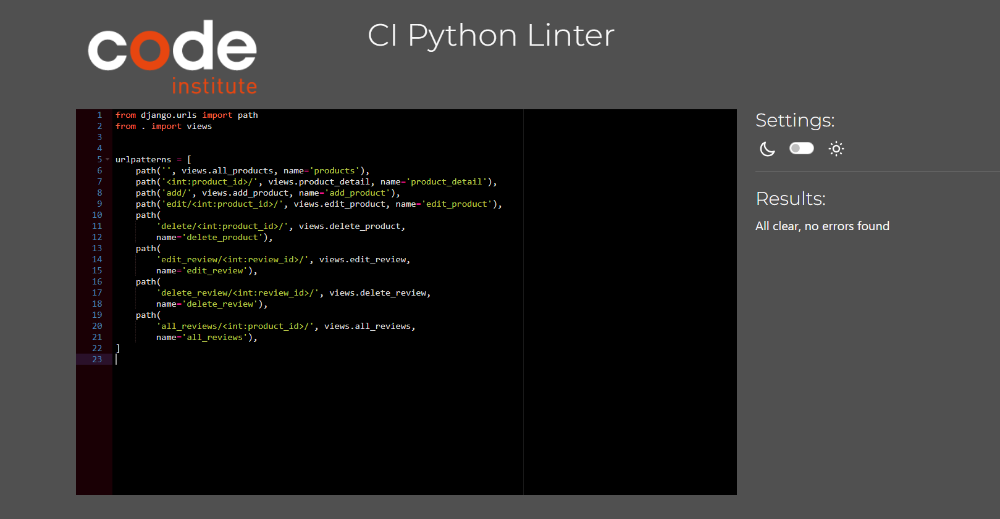
</details>

<details><summary>profiles urls.py</summary>

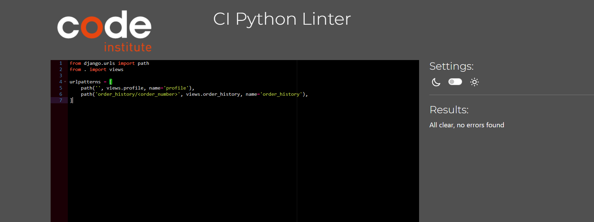
</details>

<details><summary>subcheckout urls.py</summary>


</details>

<details><summary>subscribe urls.py</summary>

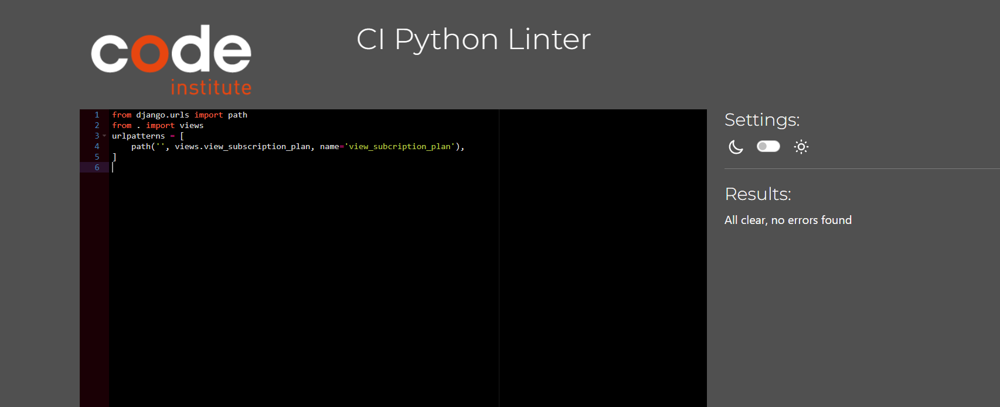
</details>

<br>

- views.py

<details><summary>bag views.py</summary>


</details>

<details><summary>checkout views.py</summary>


</details>

<details><summary>contact us views.py</summary>


</details>

<details><summary>fitness palace views.py</summary>


</details>

<details><summary>home views.py</summary>

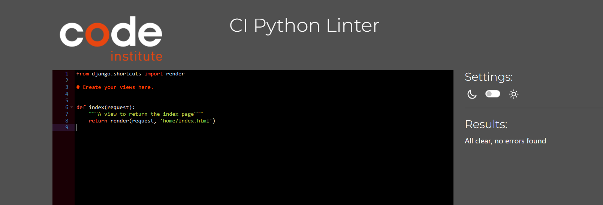
</details>

<details><summary>members views.py</summary>


</details>

<details><summary>newsletter views.py</summary>


</details>

<details><summary>products views.py</summary>


</details>

<details><summary>profiles views.py</summary>


</details>

<details><summary>subcheckout views.py</summary>


</details>

<details><summary>subscribe views.py</summary>


</details>

<br>

- forms.py

<details><summary>checkout forms.py</summary>


</details>

<details><summary>contact us forms.py</summary>


</details>

<details><summary>members forms.py</summary>


</details>

<details><summary>newsletter forms.py</summary>


</details>

<details><summary>products forms.py</summary>


</details>

<details><summary>profiles forms.py</summary>


</details>

<details><summary>subcheckout forms.py</summary>


</details>

<br>

- apps.py

<details><summary>bag apps.py</summary>


</details>

<details><summary>checkout apps.py</summary>


</details>

<br>

- contexts.py

<details><summary>bag contexts.py</summary>


</details>

<br>

- signals.py

<details><summary>checkout signals.py</summary>


</details>

<br>

- webhook_handler.py

<details><summary> checkout webhook_handler.py</summary>


</details>

<details><summary> subcheckout webhook_handler.py</summary>

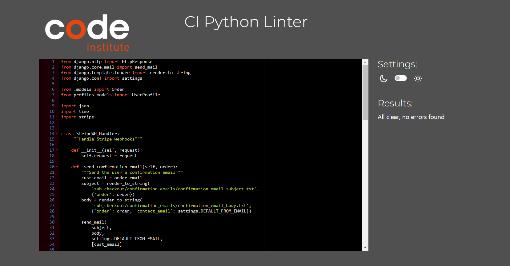
</details>

<br>

- webhook.py

<details><summary> checkout webhook.py</summary>


</details>

<details><summary> subcheckout webhook.py</summary>

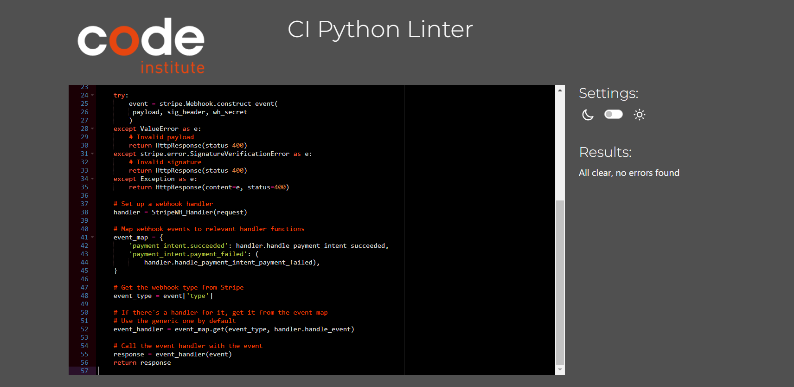
</details>

<br>

- admin.py

<details><summary>checkout admin.py</summary>


</details>

<details><summary>contact us admin.py</summary>


</details>

<details><summary>members admin.py</summary>


</details>

<details><summary>newsletter admin.py</summary>


</details>

<details><summary>subcheckout admin.py</summary>


</details>

<br>

- models.py

<details><summary>checkout models.py</summary>


</details>

<details><summary>contact us models.py</summary>


</details>

<details><summary>members models.py</summary>


</details>

<details><summary>newsletter models.py</summary>


</details>

<details><summary>products models.py</summary>


</details>

<details><summary>profiles models.py</summary>


</details>

<details><summary>subcheckout models.py</summary>


</details>

<details><summary>subscribe models.py</summary>


</details>

---
##  Deployment

### Database

To obtain your database url:

- Navigate to[PostgreSQL from Code Institute](https://dbs.ci-dbs.net/)
- Enter your student email address in the input field provided.
- Click Submit.
- Wait while the database is created.
- After your database is successfully created, the url will be emailed to your student email inbox.

### Amazon AWS

This project uses [AWS](https://aws.amazon.com) to store media and static files online, due to the fact that Heroku doesn't persist this type of data.

Once you've created an AWS account and logged-in, follow these series of steps to get your project connected.
Make sure you're on the **AWS Management Console** page.

#### S3 Bucket

- Search for **S3**.
- Create a new bucket, give it a name (matching your Heroku app name), and choose the region closest to you.
- Uncheck **Block all public access**, and acknowledge that the bucket will be public (required for it to work on Heroku).
- From **Object Ownership**, make sure to have **ACLs enabled**, and **Bucket owner preferred** selected.
- From the **Properties** tab, turn on static website hosting, and type `index.html` and `error.html` in their respective fields, then click **Save**.
- From the **Permissions** tab, paste in the following CORS configuration:

	```shell
	[
		{
			"AllowedHeaders": [
				"Authorization"
			],
			"AllowedMethods": [
				"GET"
			],
			"AllowedOrigins": [
				"*"
			],
			"ExposeHeaders": []
		}
	]
	```

- Copy your **ARN** string.
- From the **Bucket Policy** tab, select the **Policy Generator** link, and use the following steps:
	- Policy Type: **S3 Bucket Policy**
	- Effect: **Allow**
	- Principal: `*`
	- Actions: **GetObject**
	- Amazon Resource Name (ARN): **paste-your-ARN-here**
	- Click **Add Statement**
	- Click **Generate Policy**
	- Copy the entire Policy, and paste it into the **Bucket Policy Editor**

		```shell
		{
			"Id": "Policy1234567890",
			"Version": "2012-10-17",
			"Statement": [
				{
					"Sid": "Stmt1234567890",
					"Action": [
						"s3:GetObject"
					],
					"Effect": "Allow",
					"Resource": "arn:aws:s3:::your-bucket-name/*"
					"Principal": "*",
				}
			]
		}
		```

	- Before you click "Save", add `/*` to the end of the Resource key in the Bucket Policy Editor (like above).
	- Click **Save**.
- From the **Access Control List (ACL)** section, click "Edit" and enable **List** for **Everyone (public access)**, and accept the warning box.
	- If the edit button is disabled, you need to change the **Object Ownership** section above to **ACLs enabled** (mentioned above).

#### IAM

Back on the AWS Services Menu, search for and open **IAM** (Identity and Access Management).
Once on the IAM page, follow these steps:

- From **User Groups**, click **Create New Group**.
	- Suggested Name: `group-retro-reboot` (group + the project name)
- Tags are optional, but you must click it to get to the **review policy** page.
- From **User Groups**, select your newly created group, and go to the **Permissions** tab.
- Open the **Add Permissions** dropdown, and click **Attach Policies**.
- Select the policy, then click **Add Permissions** at the bottom when finished.
- From the **JSON** tab, select the **Import Managed Policy** link.
	- Search for **S3**, select the `AmazonS3FullAccess` policy, and then **Import**.
	- You'll need your ARN from the S3 Bucket copied again, which is pasted into "Resources" key on the Policy.

		```shell
		{
			"Version": "2012-10-17",
			"Statement": [
				{
					"Effect": "Allow",
					"Action": "s3:*",
					"Resource": [
						"arn:aws:s3:::your-bucket-name",
						"arn:aws:s3:::your-bucket-name/*"
					]
				}
			]
		}
		```
	
	- Click **Review Policy**.
	- Suggested Name: `policy + the project name`
	- Provide a description:
		- "Access to S3 Bucket for retro-reboot static files."
	- Click **Create Policy**.
- From **User Groups**, click your group.
- Click **Attach Policy**.
- Search for the policy you've just created and select it, then **Attach Policy**.
- From **User Groups**, click **Add User**.
	- Suggested Name: `user + the project name`
- For "Select AWS Access Type", select **Programmatic Access**.
- Select the group to add your new user to
- Tags are optional, but you must click it to get to the **review user** page.
- Click **Create User** once done.
- You should see a button to **Download .csv**, so click it to save a copy on your system.
	- **IMPORTANT**: once you pass this page, you cannot come back to download it again, so do it immediately!
	- This contains the user's **Access key ID** and **Secret access key**.
	- `AWS_ACCESS_KEY_ID` = **Access key ID**
	- `AWS_SECRET_ACCESS_KEY` = **Secret access key**

#### Final AWS Setup

- If Heroku Config Vars has `DISABLE_COLLECTSTATIC` still, this can be removed now, so that AWS will handle the static files.
- Back within **S3**, create a new folder called: `media`.
- Select any existing media images for your project to prepare them for being uploaded into the new folder.
- Under **Manage Public Permissions**, select **Grant public read access to this object(s)**.
- No further settings are required, so click **Upload**.

### Stripe API

This project uses [Stripe](https://stripe.com) to handle the ecommerce payments.

Once you've created a Stripe account and logged-in, follow these series of steps to get your project connected.

- From your Stripe dashboard, click to expand the "Get your test API keys".
- You'll have two keys here:
	- `STRIPE_PUBLIC_KEY` = Publishable Key (starts with **pk**)
	- `STRIPE_SECRET_KEY` = Secret Key (starts with **sk**)

As a backup, in case users prematurely close the purchase-order page during payment, we can include Stripe Webhooks.

- From your Stripe dashboard, click **Developers**, and select **Webhooks**.
- From there, click **Add Endpoint**.
	- `your site link/checkout/wh/`
- Click **receive all events**.
- Click **Add Endpoint** to complete the process.
- You'll have a new key here:
	- `STRIPE_WH_SECRET` = Signing Secret (Wehbook) Key (starts with **wh**)

### Gmail API

This project uses [Gmail](https://mail.google.com) to handle sending emails to users for account verification and purchase order confirmations.

Once you've created a Gmail (Google) account and logged-in, follow these series of steps to get your project connected.

- Click on the **Account Settings** (cog icon) in the top-right corner of Gmail.
- Click on the **Accounts and Import** tab.
- Within the section called "Change account settings", click on the link for **Other Google Account settings**.
- From this new page, select **Security** on the left.
- Select **2-Step Verification** to turn it on. (verify your password and account)
- Once verified, select **Turn On** for 2FA.
- Navigate back to the **Security** page, and you'll see a new option called **App passwords**.
- This might prompt you once again to confirm your password and account.
- Select **Mail** for the app type.
- Select **Other (Custom name)** for the device type.
	- Any custom name, such as "Django"
- You'll be provided with a 16-character password (API key).
	- Save this somewhere locally, as you cannot access this key again later!
	- `EMAIL_HOST_PASS` = user's 16-character API key
	- `EMAIL_HOST_USER` = user's own personal Gmail email address


### Heroku

The development of this project was done with Gitpod, stored on GitHub and deployed using Heroku.
1. Visit [Heroku](https://heroku.com/)
2. Log in or create an account if applicable.
3. On the Heroku dashboard click on the 'new' button.
4. From the drop-down menu select 'Create new app'.
5. Choose your preferred app name.
6. Select the applicable region and click 'Create App'.
7. Navigate to 'Settings' and scroll down to the 'Config Vars' section. Click on 'Reveal Config Vars' and enter all the details you have on your env.py file. Remember to use your production database here.
8. Click on the 'Deploy' tab. Select GitHub and the connect to the relevant repository. Click 'Deply branch'. You can also select 'Automatic Deploys' so that the site updates when updates are pushed to GitHub, however, you must set 'DEBUG = False' in your settings.py to avoid security concerns for your site.
9. After your deployment is successful click 'Open app' to view thelive app.


### Forking the GitHub Repository

To use this code and make changes without affecting the original code, it is possible to 'fork' the code on the GitHub repository through the following steps:

1. Create  or log into your GitHub account.
2. Go to the GitHub [repository](https://github.com/osaroo3/fitness-palace-ci-project5).
3. Click the 'Fork' button in the upper right-hand corner of the page.
A copy of the repository will be available in your own repository.


### Making a Local Clone

1. Log in to GitHub and locate the GitHub Repository
2. Under the repository name choose button "Code",  click "Clone or download".
3. To clone the repository using HTTPS, under "Clone with HTTPS", copy the link.
4. Open your development editor of choice and open a terminal window in a directory of your choice
5. Type *git clone*, and then paste the URL you copied in Step 3.

``> git clone https://github.com/YOUR-USERNAME/YOUR-REPOSITORY``

Press Enter. 

Your local clone will be created.

For more information follow this [link](https://docs.github.com/en/repositories/creating-and-managing-repositories/cloning-a-repository#cloning-a-repository-to-github-desktop).


[Back to the top](#table-of-contents)


## Credits

### Code

The idea for structure and the code of this project was from Code Institute's Codestar blog and Boutique Ado walkthrough projects:
  * The base.html code and styling is a modification of that of Boutique Ado walkthrough project.
  * Credit to [LarisaLG](https://github.com/LarisaLG/barbershop) for the idea of the my plans page with styling.
  * The javaScript code functionlity are from Boutique Ado project.
  * The idea for my models.py was from code institutes codestar blog and Boutique Ado walkthrough project
  * Credit to [W3schools](https://www.w3schools.com/) on horizontal lines styling to grow with the page length.
  * Credit to [Django documentation](https://docs.djangoproject.com/en/5.0/) for "Everything you need to know about Django".


### Content and Media

  * credit to [LarisaLG](https://github.com/LarisaLG/barbershop) and [osaroo3](https://github.com/osaroo3/django_restaurant_ci_project4) for the readme structure.
  * Credit to [LarisaLG](https://github.com/LarisaLG/barbershop) on how to fork a GitHub repository or make a local clone.
  * Credit to [CodeWizard](https://github.com/CodeWizard-1/e-commerce) for AWS, S3 bucket, IAM, StripeAPi setup description.

Credit to the following for the images:

 * All images where from [pexels.com](https://www.pexels.com/)

Note: The use of these images were strictly for educational purposes only


### Acknowledgments

I wish to acknowledge my mentor Martina Terlevic, Mitko Bachvarov, Code Institute's 'Tutor me' and the CI slack community for all the support thus far.
